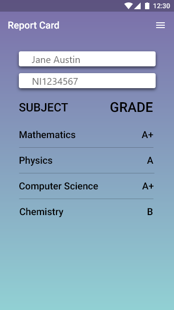

# ABND | ReportCardApp
This is the fifth project completed for the Android Basics Nanodegree program offered by Udacity in collaboration with Google.

# Project Description
The goal is to design and create the structure of a ReportCard Java Class which would allow a school to store a student’s grades for a particular year. This project will be just a java class, rather than a full Android app.

# Pre-requisites
Android SDK v22
Android Build Tools v22.0.1
Android Support Repository v22.1.1

# Learning objectives
This project is about combining various ideas and skills we’ve been practicing throughout the course. They include:

- Designing a custom class
- Creating that class in Java code.
- Storing information in an array
- Looping through an array
